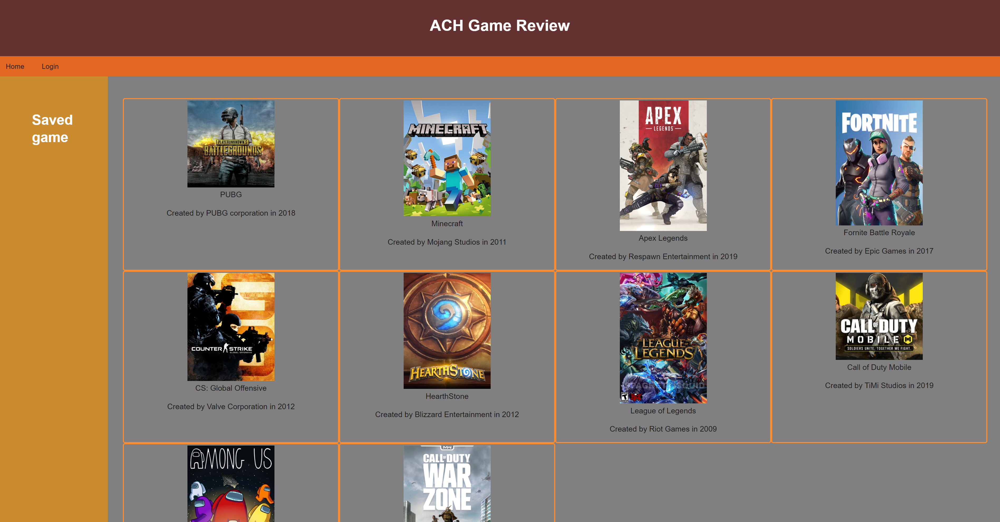

# ACH_Game_Review

## Badge 

## Description 
This application was designed to display the most played games. Once you login or create a account. You can click into any of the games and add a review and rating of what you think of the game. You can also save the game so you can click into the game faster and see what other user's think of the game. Use test@test.com and password is testtest after visiting this link: [ACH Game Review link](https://mighty-beyond-89277.herokuapp.com/) to test our app.

## Table of Contents (Optional)
- [Demo](#demo)
- [License](#license)
- [Technologies](#technologies)
- [Usage](#usage)
- [E-mail](#e-mail)

## Demo

## License
MIT License
Permission is hereby granted, free of charge, to any person obtaining a copy of this software and associated documentation files the Software, to deal in the Software without restriction, including without limitation the rights to use, copy, modify, merge, publish, distribute, sublicense, and/or sell copies of the Software, and to permit persons to whom the Software is furnished to do so, subject to the following conditions. Click on Badge for more info.

## Technologies
- Bcrypt
- sequelize
- Express
- Handlebars
- Dotenv
- Mysql

## Usage
- Visit the Link below then just sign-up and start posting. 
- [ACH Game Review link](https://mighty-beyond-89277.herokuapp.com/)

## features
- Express for building the server
- mysql for building the tables.
- Sequelize for updating and requesting queries. 
- Handlebars to structure Front-end files
- Bcrypt for keeping user password safe.

## Questions
Contact information below!
### Username
<a href="https://github.com/Skruphold">Skruphold</a>
<a href="https://github.com/AndrewSchoenbauer">Andrew</a>
<a href="https://github.com/luckylobster25">luckylobster25</a>
